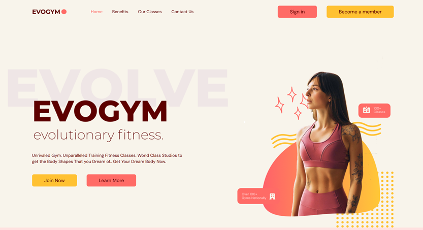

# Fitness Evogym

**Live Demo:**

[](https://react-ts-fitness-lending-v749.vercel.app/)

### Используемые технологии

- Vite (vite, @vitejs/plugin-react)
- TypeScript
- Tailwind CSS 4 (tailwindcss, postcss)
- Framer Motion (анимации)
- React Scroll (плавный скроллинг)

### Запуск проекта

```bash
npm run dev
```

### Settings

- File vite.config.ts

```ts
import { defineConfig } from "vite";
import react from "@vitejs/plugin-react";
import path from "path";

// https://vite.dev/config/
export default defineConfig({
  plugins: [react()],
  resolve: {
    alias: [{ find: "@", replacement: path.resolve(process.cwd(), "src") }],
  },
});
```

- settings.json в VS Code

```json
{
  "files.associations": {
    "*.css": "tailwindcss"
  },
  "editor.quickSuggestions": {
    "strings": true
  },
  "tailwindCSS.includeLanguages": {
    "javascript": "javascript",
    "typescript": "typescript",
    "javascriptreact": "javascript",
    "typescriptreact": "typescript"
  },
  "tailwindCSS.experimental.classRegex": [
    "clsx\\(([^)]*)\\)",
    "cn\\(([^)]*)\\)"
  ]
}
```
